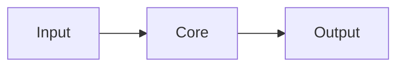

# README Forge

Generate a README following alxx's personal style.

## Step 1: Analyze the Repository

Target: $ARGUMENTS (if blank, use current working directory).

Read the codebase to understand:
- What it does (one sentence)
- Who it's for
- Tech stack and architecture
- How to install and run it
- Key features
- Build/test commands
- License
- Dependencies and credits

Read existing README if one exists. Check CLAUDE.md, package.json, go.mod, Makefile, Cargo.toml for project metadata.

## Step 2: Apply alxx's README Pattern

Every README follows this exact structure. Do not skip sections, do not reorder.

### Structure

```markdown
# Project Name

OR replace h1 with a banner image:
- Full-width branded banner at `assets/project-github-banner.png` (recommended: ~2075x208px, 10:1 aspect ratio)
- Followed by `---` separator
- Optional: centered badge row (CI, coverage, tests) under the separator using `<p align="center">`
- When banner is present, use `## 🚀 Overview` (with rocket emoji)
- When no banner (just h1), use `## Overview` (no emoji)

**Bold tagline - one line, punchy, states the core value prop.**

## Overview (or 🚀 Overview if banner present)

What this is in 2-3 sentences. Include a **bold analogy** comparing it to something familiar
(e.g. "Git for agent context", "your Teams data in your terminal").

***Bold italic one-liner for the key technical differentiator.***

## Quickstart

Copy-paste commands to get running. No explanation between commands unless critical.
Start from git clone or go install, end with the app running.

```bash
git clone ...
cd ...
make setup
make dev
```

## Why

2-3 sentences on the problem. Why existing solutions suck.
Direct, slightly opinionated. No corporate speak.

## Features

- **Feature Name** - what it does, one line
- **Feature Name** - what it does, one line
- **Feature Name** - what it does, one line

Bold the feature name, dash separator, brief description. 5-8 features max.

## Vision (optional - include only for ambitious/platform projects, skip for focused tools)

Where this is going. 2-3 sentences. Forward-looking but concrete.
Mention what's next without over-promising.

## Architecture

Mermaid diagram showing the main flow. Keep it simple - major components and their connections.
Flowchart LR preferred (left-to-right reads naturally).




## Contributing

2-3 lines. "PRs welcome. For major changes, open an issue first."
Mention CLA if one exists. Keep it short.

## Legal

One line on licensing. Mention any API usage disclaimers if relevant.

## License

One line linking to LICENSE file. e.g. `[MIT](LICENSE)`
```

**Sections can vary from project to project** - not every project needs Why, Vision, or Architecture. Adapt based on what's relevant. But the style is always kept: short, concise, dense, no fluff. Every section earns its place or gets cut.

## Step 3: Style Rules

These are non-negotiable:

- **h1 or banner** - either `# Name` or full-width banner image with `---` separator
- **Bold tagline** directly under h1/banner, no gap
- **Overview** - first section is always Overview. use 🚀 emoji only when banner is present, plain `## Overview` otherwise
- **Blockquote pitch** for the audience, in or after overview
- **Bold analogy** in overview (comparing to something familiar)
- **Bold italic** (`***text***`) for punchy one-liners
- **Bold feature names** with dash separator in features list
- **Mermaid diagram** - always include one, flowchart LR preferred
- **Quickstart must be copy-paste** - someone should be able to run every command in order
- **FAQ is optional** - rarely used, only include for projects with common objections (e.g. "why not X?"). if something needs explaining, prefer putting it in the relevant section
- **No badges** unless the project has CI set up
- **Bold key phrases in longer text** - in paragraphs, `**bold**` the important terms/concepts so readers can scan (e.g. "Nebula is **Git for agent context & tasks**")
- **Dense, no fluff** - every sentence carries information
- **No "Getting Started" header** - use "Quickstart" for apps/CLIs, "Install" for packages/skills/libraries
- **No separate "Installation" header** - fold into Quickstart or Install
- **No "Usage" header** - fold into Quickstart or Features
- **No long dashes** - never use "—" (em dash), use "-" or commas instead
- **No AI slop** - no "furthermore", "it's worth noting", "comprehensive"
- **Casual but professional** - not corporate, not too informal for a repo README

## Step 4: Tone Calibration

Read the project's CLAUDE.md or existing docs to match tone. If it's a serious infrastructure tool, lean professional. If it's a personal tool, lean slightly casual. Never go full bro-mode in a public README.

Key phrases that fit alxx's style:
- "No middleman" / "no admin consent"
- "Single binary" / "your data, your machine"
- "Local-first, privacy-first"
- Direct comparisons: "Every existing X requires Y. This needs none of that."
- Forward-looking vision without buzzwords

## Step 5: Generate

Write the full README following the structure above. Include sections that are relevant to the project, skip ones that aren't. Keep the order.

## Step 6: Validate

- [ ] h1 or banner image at top
- [ ] Bold tagline under h1/banner
- [ ] Overview as first section (🚀 emoji only if banner present)
- [ ] Blockquote audience pitch
- [ ] Overview with bold analogy
- [ ] Bold italic differentiator line
- [ ] Quickstart with copy-paste commands
- [ ] Why section (problem statement)
- [ ] Features with bold names + dash + description
- [ ] Vision section (optional - only for platform/ambitious projects)
- [ ] Mermaid architecture diagram
- [ ] Contributing section (short)
- [ ] Legal section
- [ ] Credits section (if applicable)
- [ ] FAQ only if truly needed (rare)
- [ ] No "Getting Started", "Installation", or "Usage" headers
- [ ] No AI slop phrases
- [ ] Under 200 lines (aim for 80-150)
- [ ] Every command in Quickstart actually works
